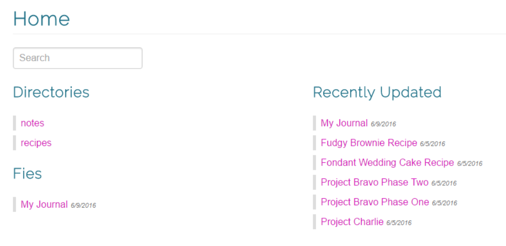
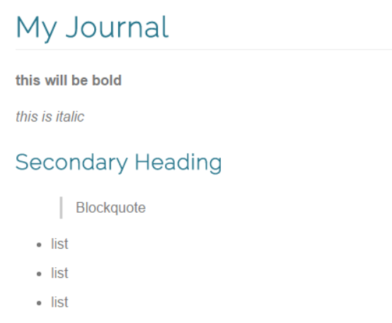

# mdgen
Converts markdown (commonmark) to HTML with navigation and search, built with F#

## Usage
```
mdgen sourceDir tagetDir [--watch]
```

- Converts all `.md` files in `sourceDir` to HTML using a template into `targetDir`
 - The HTML title of the markdown file will be the first H1 found in the document, if found (e.g. `# My Title`)
 - Use any web server to server the contents of `targetDir`, it's just static HTML
- Generates a `index.html` file at the root of `targetDir` with
  - A list of all top-level subdirectories and files
  - A list of 10 most recently updated files
  - A search function based on file title
- Traverses all subdirectories and generates a `index.html` file containing a list of links to files and subdirectories
  - You can override these auto-generated files by writing your own `index.md` file in a subdirectory
- The `--watch` flag watches for changes in `sourceDir` and automatically rebuilds

## Output

Home page



Document page



## Customize
You can customize the generated HTML by placing a `layout.html` file in the source directory.  
See `Templates.DefaultLayoutTemplate` contains the default html you can use as inspiration.